# Dokumentacja projektu – Komis Laravel

System CMS dla ogłoszeń motoryzacyjnych.

---

## Przeznaczenie aplikacji

Aplikacja pełni funkcję platformy do wystawiania i przeglądania ogłoszeń motoryzacyjnych (sprzedaż samochodów) oraz usług warsztatowych (mechanika, detailing, naprawy). Umożliwia:

- Przeglądanie ogłoszeń aut z zaawansowanym filtrowaniem i wyszukiwaniem
- Dodawanie i zarządzanie ogłoszeniami przez użytkowników
- Wystawianie usług motoryzacyjnych z opiniami i ocenami
- Komunikację między użytkownikami przez wbudowany czat
- Zarządzanie treścią przez panel administratora

---

# DIAGRAM ERD

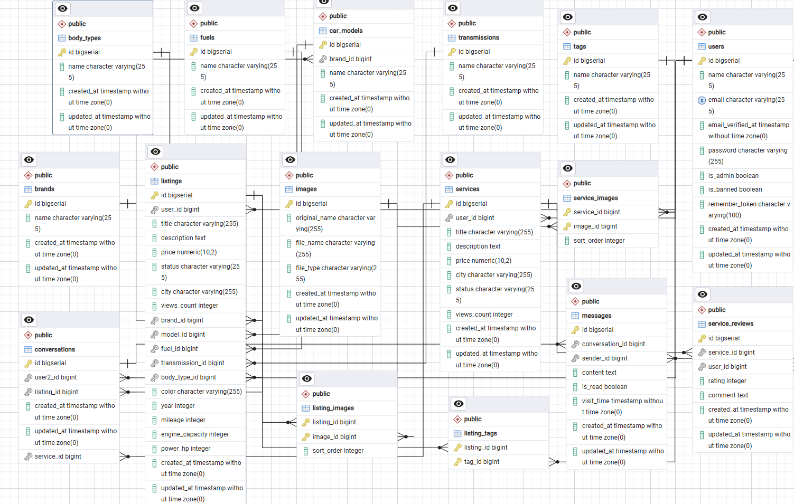

---

## Użyte technologie

| Technologia | Wersja | Zastosowanie |
|-------------|--------|--------------|
| **Laravel** | 13.15.0 | Framework backendowy MVC |
| **PHP** | ^8.4 | Język programowania |
| **Docker** | 28.x | Kontenery |
| **Docker Compose** | 2.x | Uruchamianie projektu |
| **Bootstrap** | 5.3.0 | Frontend – stylowanie, responsywność, komponenty UI |
| **PostgreSQL** |18.4 | Relacyjna baza danych (z obsługą pg_trgm) |
| **Leaflet.js** | 1.9.4 | Mapy interaktywne (OpenStreetMap) |
| **Google Maps** | – | Osadzanie map w widokach |


## Opis funkcjonalności

### Moduł Rafała Burbeło – Strona główna, listingi, panel admina/user

- **Strona główna**: lista polecanych ogłoszeń (6 najnowszych), popularne tagi, statystyki (liczba ogłoszeń, marek, usług)
- **Lista ogłoszeń**: widok grid z paginacją (10/12/20 na stronę)
- **Filtrowanie**: marka, model, cena (od-do), rok, paliwo, skrzynia biegów, nadwozie, miasto, lokalizacja (mapa, współrzędne), tagi, przebieg, moc, pojemność silnika
- **Wyszukiwanie**: pełnotekstowe z użyciem pg_trgm (similarity) po tytule, opisie, mieście, kolorze, marce, modelu
- **Sortowanie**: cena (ros./malej.), rok, przebieg, popularność, najnowsze
- **Panel admina**: zarządzanie użytkownikami (CRUD, banowanie – toggleBan, zabezpieczenie przed banowaniem siebie)
- **Panel użytkownika**: lista własnych ogłoszeń z możliwością edycji/usunięcia, dashboard ze statystykami
- **Autocomplete marek/modeli**: wyszukiwanie przez similarity() pg_trgm w formularzu dodawania/edycji ogłoszenia


### Moduł Jakuba Czarnika – Widok ogłoszenia, komentarze, chat, admin

- **Widok ogłoszenia**: galeria zdjęć (Bootstrap carousel), dane techniczne auta (marka, model, rok, paliwo, skrzynia, moc, pojemność, przebieg, kolor), opis, cena, lokalizacja na mapie Google
- **Dodawanie ogłoszeń**: dodawanie ogłoszeń o sprzedaży samochodu
- **Chat**: konwersacje między użytkownikami, lista konwersacji z licznikiem nieprzeczytanych wiadomości, obsługa zarówno listingów jak i usług, oznaczenie wiadomości jako przeczytane (is_read, visit_time)
- **Panel admina**: słowniki (dodawanie modeli, marek, tagów itp.)


### Moduł Jakuba Dobka – Serwisy (usługi motoryzacyjne)

- **Lista usług**: widok kafelkowy z paginacją (12/str)
- **Filtrowanie**: miasto (select z listy miast), cena (min/max), wyszukiwanie tekstowe (tytuł, opis, miasto)
- **Sortowanie**: cena (ros./malej.), data, popularność (views_count), najlepiej oceniane (withAvg)
- **Widok usługi**: karuzela zdjęć, opis, cena, średnia ocen (gwiazdki full/half/empty), liczba opinii, miasto, data, wystawiający, mapa Google, licznik wyświetleń
- **CRUD**: create/store (z mapą Leaflet + reverse geocoding Nominatim), edit/update (z zarządzaniem zdjęciami), destroy (usunięcie plików z dysku)
- **Opinie**: addReview/updateReview (1 opinia na użytkownika na usługę, duplicate check), rating 1-5, comment max 1000 znaków
- **Średnia ocen**: metoda `averageRating()` w modelu, sortowanie `best_rated` przez `withAvg()`

### Moduł Vladyslava Denysiuka – Autoryzacja i użytkownicy

- **Rejestracja**: walidacja (name, email unique, password min:8 + confirmed), hash bcrypt, przekierowanie na login z flash message
- **Logowanie**: walidacja credentials, regeneracja sesji, obsługa banned (Auth::logout + session invalidate + komunikat)
- **Wylogowanie**: destrukcja sesji, regeneracja tokena CSRF
- **Profil użytkownika**: edycja danych (name, email) z walidacją unique, zmiana hasła (current_password, new password + confirmation)
- **Middleware**: `admin` alias w bootstrap/app.php, sprawdza `$user->is_admin`, 403 dla nieautoryzowanych, redirect na login dla gości
- **Obsługa banów**: pole `is_banned` w tabeli users, blokada logowania, admin może toggle ban (zabezpieczenie przed banowaniem siebie)


### Wspólne funkcjonalności

- **Walidacja**: backend (`$request->validate()`) z polskimi komunikatami błędów; frontend (`is-invalid`, `@error`, `required`)
- **Responsywność**: Bootstrap 5.3 grid (col-lg, col-md, col-), flex, table-responsive, navbar z togglerem
- **Obsługa błędów HTTP**: abort(403), abort(404), findOrFail(), firstOrFail(), flash messages (success/error)
- **ORM**: Eloquent z relacjami (belongsTo, hasMany, belongsToMany), query builder z bind parameters (whereRaw)
- **Seedery**: DatabaseSeeder uruchamia ImageSeeder (z rzeczywistymi zdjęciami z `database/seed-images/`), CarDataSeeder, ListingSeeder, TagSeeder, ServiceSeeder


## Instrukcja uruchomienia aplikacji

### Wymagania

- Laravel 13x
- Docker 28.x
- PHP ^8.4 z rozszerzeniami: `pgsql`, `mbstring`, `xml`, `curl`, `gd`, `fileinfo`
- Docker Compose 2.x
- PostgreSQL 15+
- Rozszerzenie PostgreSQL `pg_trgm`

### Krok po kroku

1. **Klonowanie repozytorium**
   ```bash
   git clone <adres-repozytorium>
   cd Komis-Laravel
   ```

2. **Uruchomienie projektu**
   ```bash
   docker compose up
   ```

3. **Konfiguracja środowiska**
   ```bash
   cp .env.example .env
   ```
   Edytuj `.env`:
   ```
   DB_CONNECTION=pgsql
   DB_HOST=db
   DB_PORT=5432
   DB_DATABASE=laravel
   DB_USERNAME=laravel
   DB_PASSWORD=secret
   ```

4. **Generowanie klucza**
   ```bash
   docker compose run --rm web php artisan key:generate
   ```

## Kierunki rozwoju

- Powiadomienia e-mail o nowych wiadomościach na czacie oraz odpowiedziach na ogłoszenia i usługi.
- System ulubionych ogłoszeń i usług, umożliwiający zapisywanie interesujących ofert przez użytkowników.
- Powiadomienia w czasie rzeczywistym (WebSockets / Laravel Reverb) dla czatu i nowych aktywności.
- Panel statystyk użytkownika z wykresami wyświetleń oraz zainteresowania ogłoszeniami.
- System zgłaszania nieodpowiednich treści wraz z panelem moderacji dla administratorów.
- Obsługa materiałów wideo obok zdjęć w ogłoszeniach i usługach.
- Integracja z zewnętrznymi API motoryzacyjnymi, umożliwiająca automatyczne pobieranie danych pojazdu na podstawie numeru VIN.
- Zaawansowane wyszukiwanie lokalizacji z filtrowaniem po promieniu od wskazanego punktu na mapie.
- REST API umożliwiające integrację z aplikacjami mobilnymi i zewnętrznymi systemami.

## Przebieg użycia aplikacji

### Scenariusz 1: Sprzedawca wystawia ogłoszenie, kupujący pisze na czacie

1. **Rejestracja** – nowy użytkownik wypełnia formularz (name, email, password + confirmation)
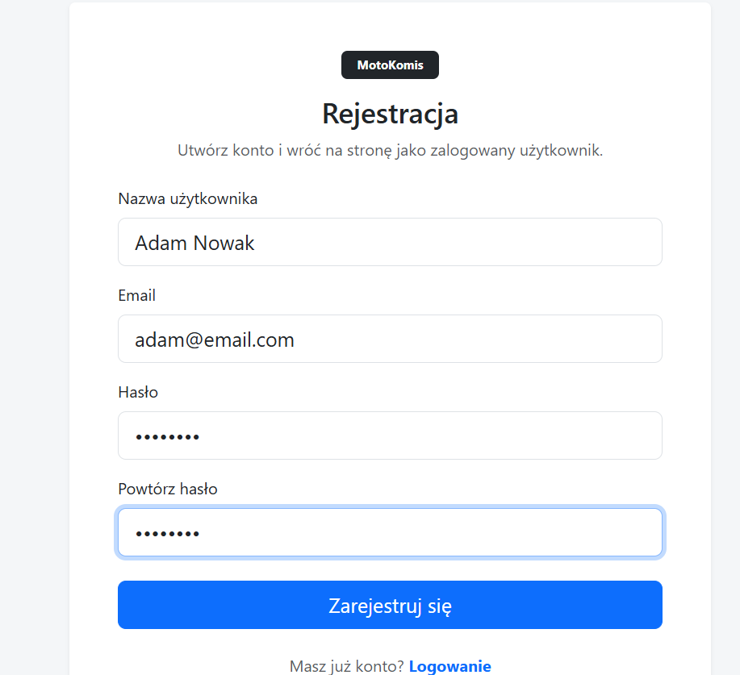
2. **Logowanie** – system regeneruje sesję, sprawdza czy nie jest zbanowany
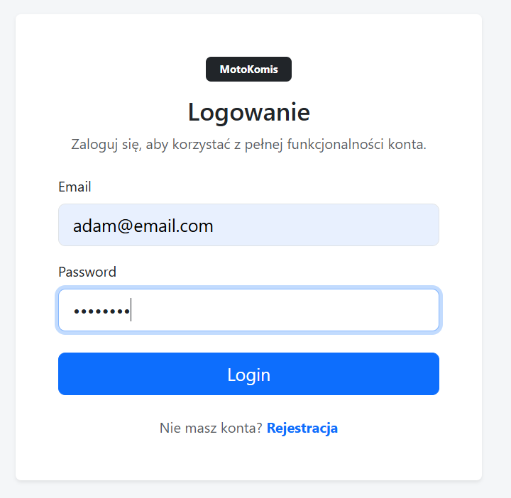
3. **Dodanie ogłoszenia** – użytkownik wypełnia formularz: marka (autocomplete), model, rok, paliwo, skrzynia, nadwozie, cena, przebieg, moc, pojemność, kolor, lokalizacja (mapa), tagi
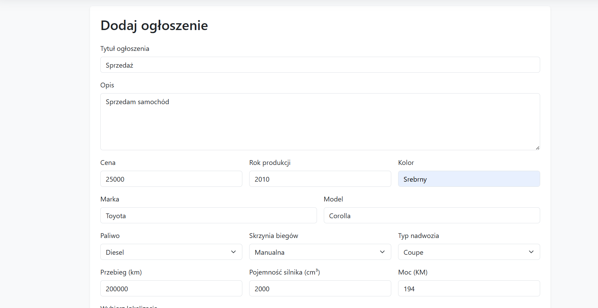
4. **Dodanie zdjęć** – po zapisie przekierowanie do strony dodawania zdjęć
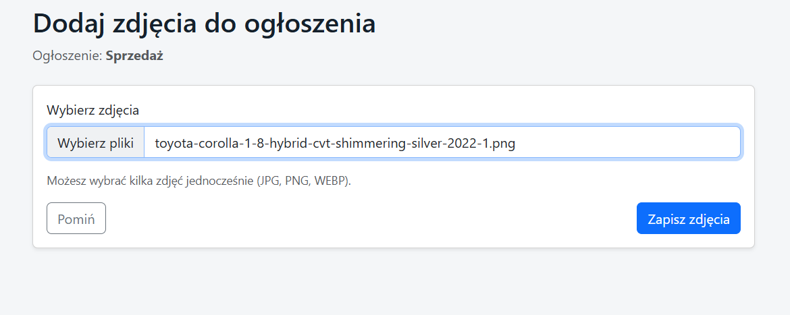
5. **Kupujący szuka** – używa filtrów (marka, model, cena, paliwo), sortuje, paginacja
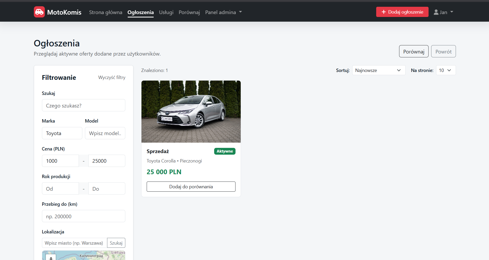
6. **Widok ogłoszenia** – galeria, dane techniczne, opis, cena, mapa Google
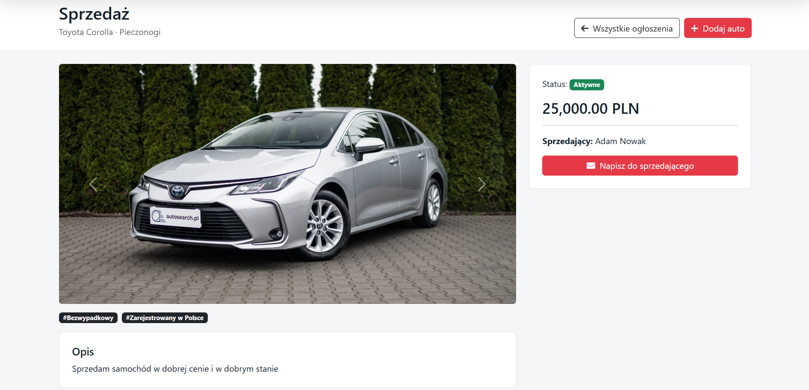
7. **Czat** – kupujący klika "Napisz do sprzedawcy", system tworzy konwersację
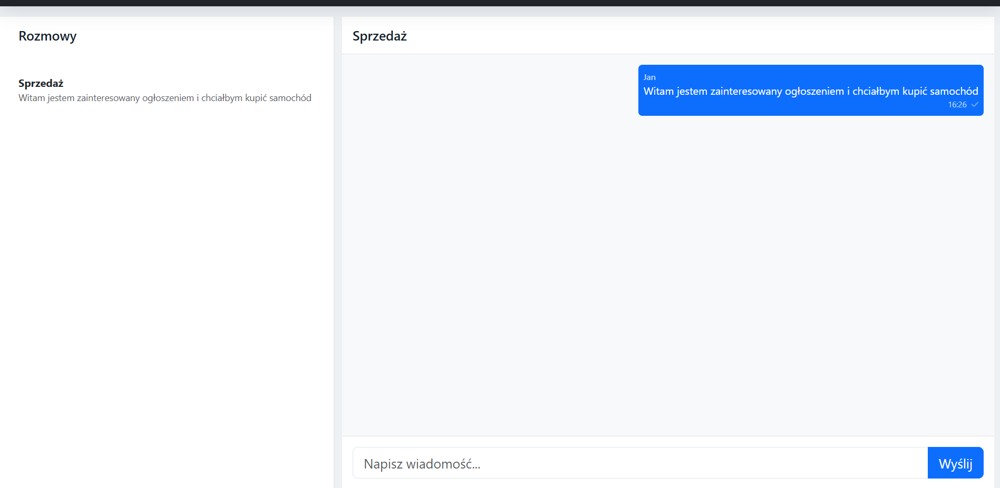
8. **Sprzedawca odpowiada** – widzi nową wiadomość w panelu konwersacji
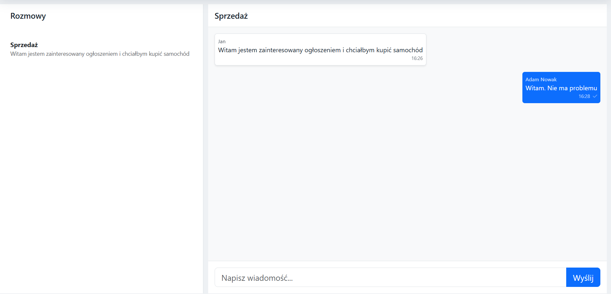
### Scenariusz 2: Mechanik dodaje usługę, klient wystawia opinię

1. **Dodanie usługi** – mechanik wypełnia formularz, wybiera lokalizację na mapie Leaflet (auto-geokodowanie), dodaje zdjęcia
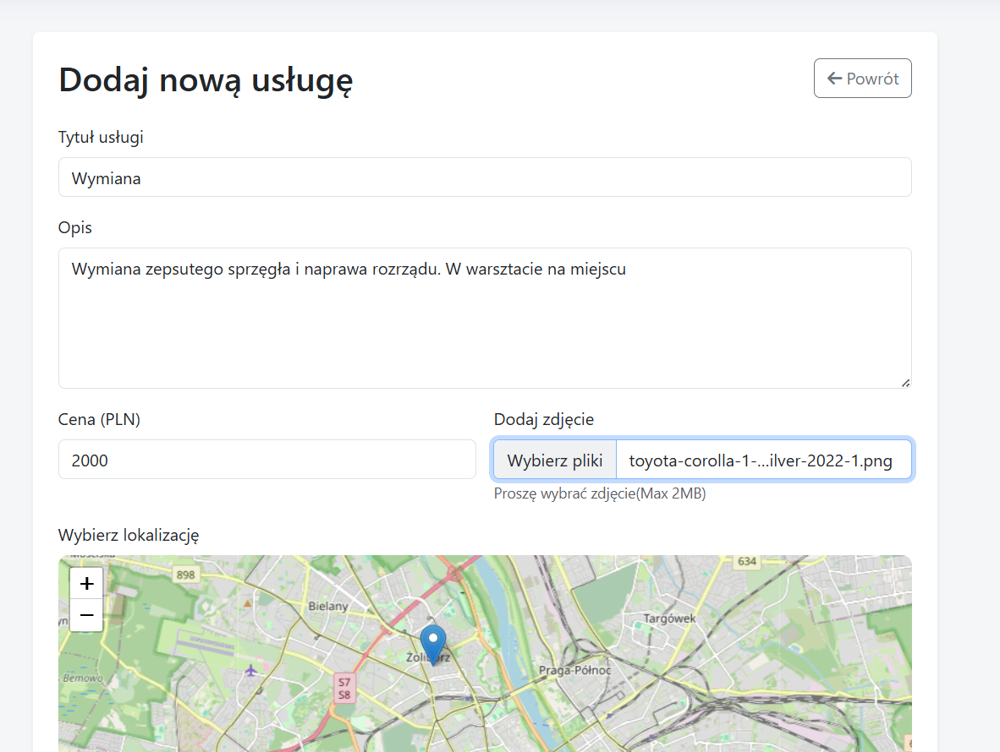
2. **Przeglądanie** – klient filtruje po mieście i cenie, sortuje po ocenie
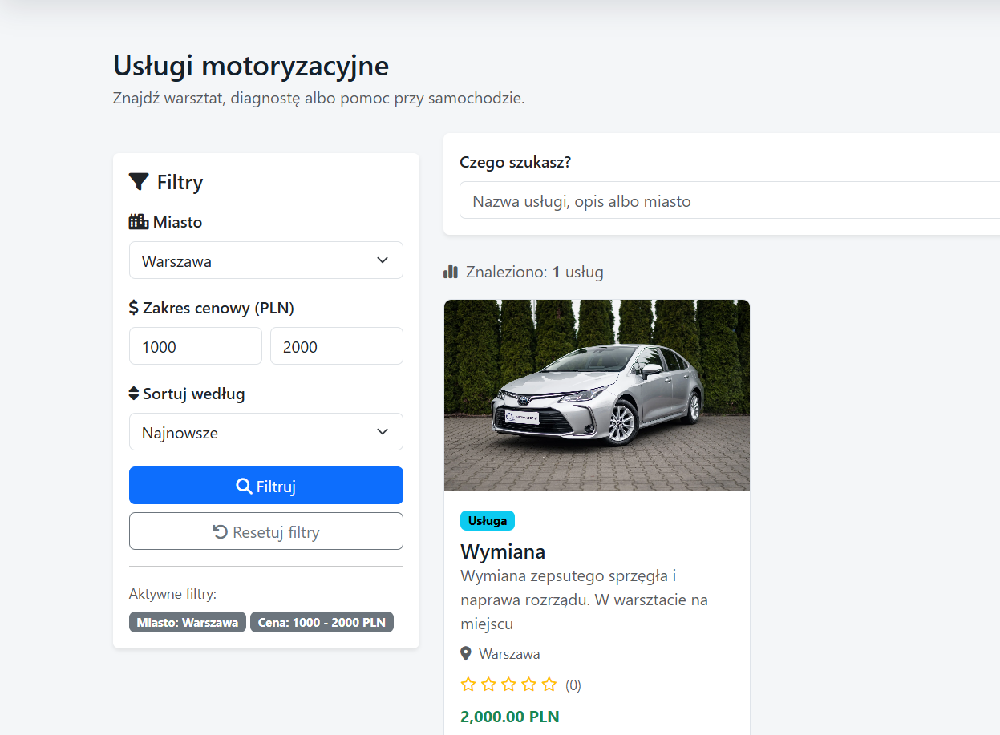
3. **Widok usługi** – karuzela zdjęć, opis, cena, średnia ocen, opinie, mapa
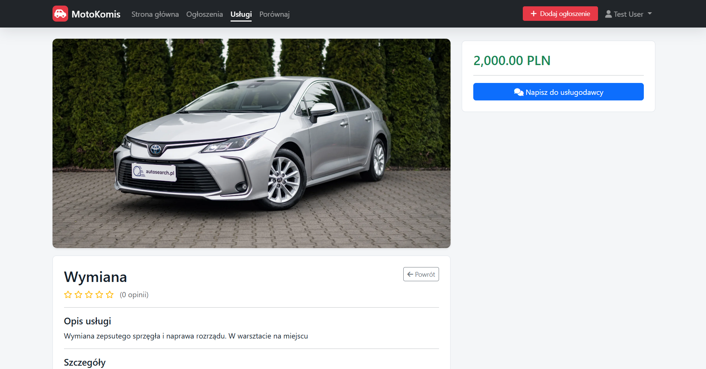
4. **Kontakt** – "Napisz do usługodawcy" przez czat
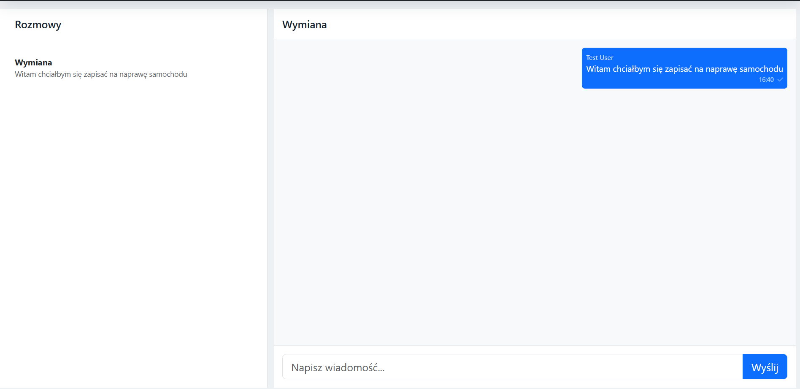
5. **Opinia** – klient wystawia ocenę (1-5) i komentarz, średnia automatycznie aktualizowana
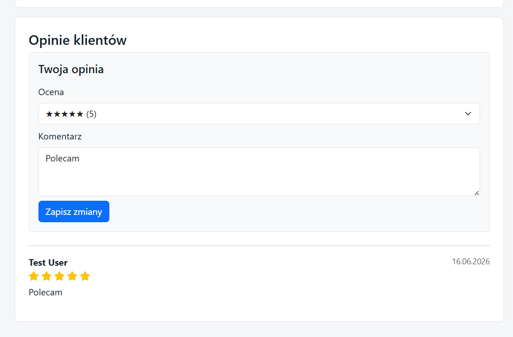
6. **Panel usługodawcy** – "Moje usługi" z liczbą wyświetleń, edycja/usuwanie
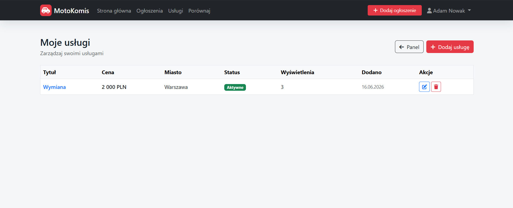
